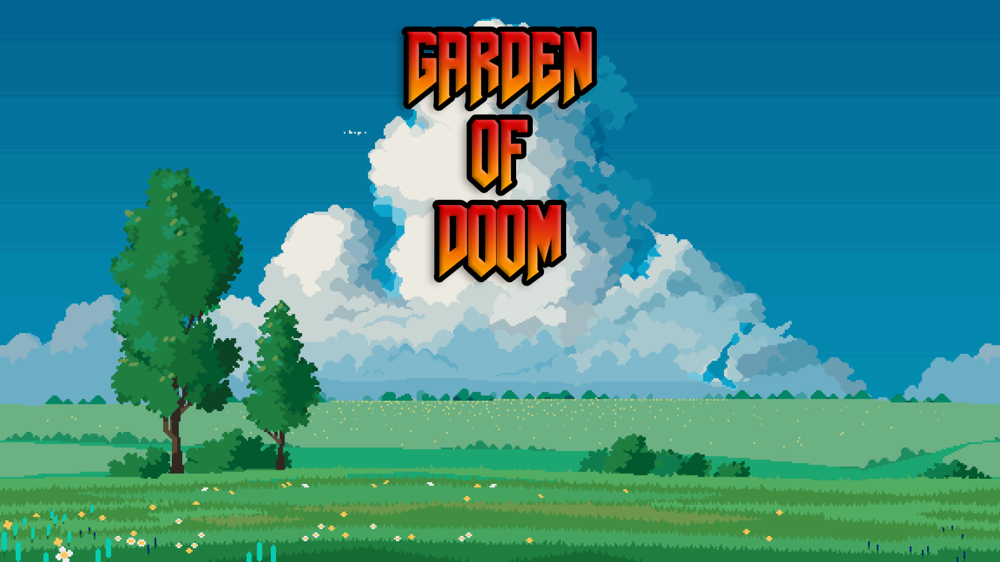
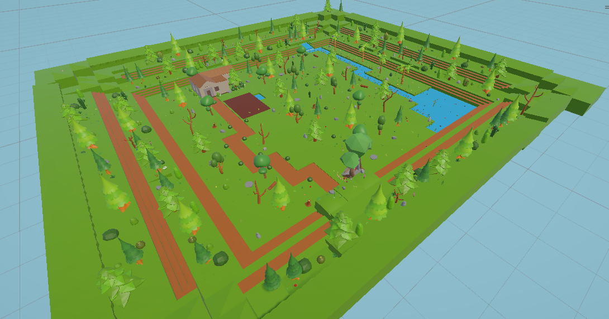
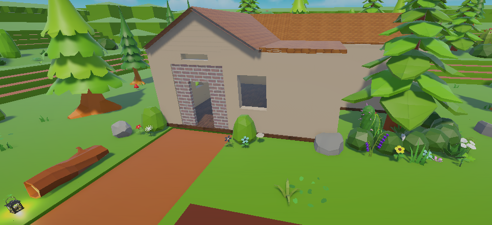
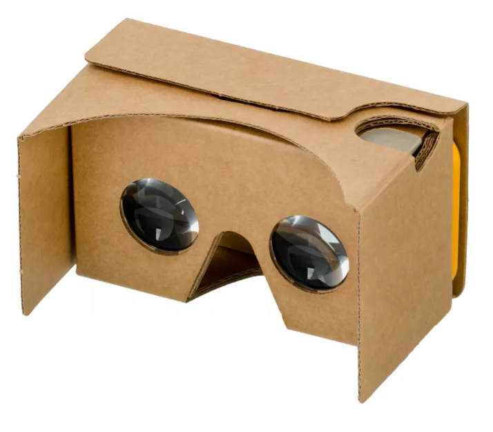
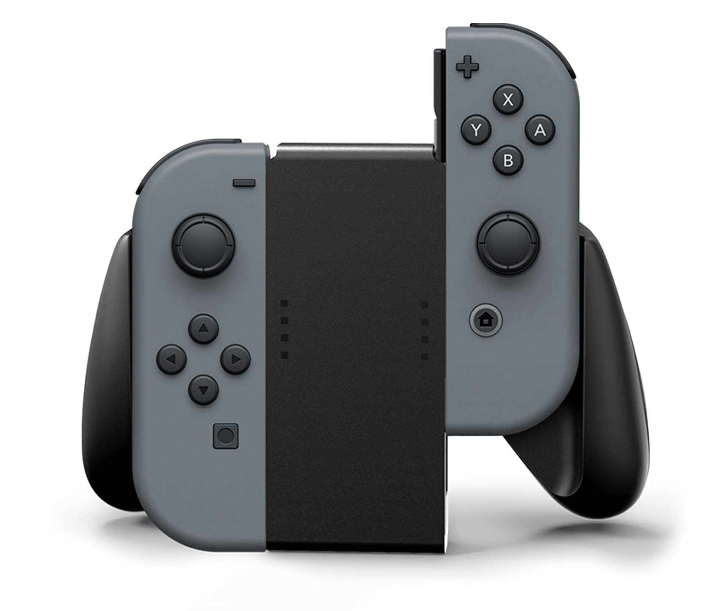

# Garden of Doom
## Proyecto final Interfaces Inteligentes
### Desarrollado por

- Alejandro Miguel Cruz Quiralte
- Nailea Fayna Cruz Galván
- Sara Darias Sánchez
- Abián Santana Ledesma

# COSAS A HACER (ESTO SE VA A BORRAR)
no olvidar subir apk

para el zip que la profe quiere, solo incluir el readme y scripts (creo, ns si le importa ponerlo todo junto y ya)

no olvidar enlazar los script

no olvidar comentar el codigo

no olvidar la presentación (8 minutos asi que veloces xd). 2 cada uno

## Índice

- [Presentación del juego](#presentación-del-juego)
  - [Descripción](#descripción)
  - [Mecánicas](#mecánicas)
  - [Diseño de escenario](#diseño-de-escenario)
  - [Controles](#controles)
  - [GIF demo](#gif-demo)
- [Cuestiones importantes para el uso](#cuestiones-importantes-para-el-uso)
- [Aspectos destacables](#aspectos-destacables)
- [Estructura de los scripts](#estructura-de-los-scripts)
- [Hitos de programación logrados](#hitos-de-programación-logrados)
- [Elementos externos](#elementos-externos)
- [Sensores](#sensores)
- [Acta de acuerdos del grupo](#acta-de-acuerdos-del-grupo)
- [Checklist de recomendaciones de diseño de aplicaciones de RV](#checklist-de-recomendaciones-de-diseño-de-aplicaciones-de-rv)
- [Enlaces de interés](#enlaces-de-interés)
- [Posibles mejoras](#posibles-mejoras)
- [Ejecución del juego (extendido)](#ejecución-del-juego-extendido)

## Presentación del juego

### Descripción

**Garden of Doom** es nuestro proyecto para la asignatura de **Interfaces Inteligentes**, en el que desarrollamos un prototipo de videojuego de Realidad Virtual utilizando la herramienta Unity3D para dispositivos Android.

En este juego encarnamos a un aldeano que vive tranquilamente en una pequeña casa en mitad del bosque. Sin embargo, algo irrumpe en su pacífica vida: se ha abierto un portal a otra dimensión, una dimensión demoníaca. Los demonios que emergen de ella tienen una extraña afición: quieren destruir nuestro jardín.

El objetivo del juego será, por tanto, proteger y mantener nuestro jardín, plantar nuevas plantas y evitar que los demonios las destruyan. Para ello, deberemos eliminar a los demonios, que son muy tímidos y mueren mediante el contacto visual.

Cada vez que derrotamos a uno de estos demonios, obtenemos monedas. Con ellas podremos acceder al **catálogo de objetos**, donde comprar muebles para decorar nuestra vivienda y, poco a poco, recuperar la calma de la vida rural.

De este modo, presentamos Garden of Doom como una bonita y encantadora fusión entre un mundo adorable y colorido, y la amenaza constante de un imaginario demoníaco.

### Mecánicas

El juego se desarrolla en un entorno de Realidad Virtual en el que el jugador interactúa principalmente mediante la mirada, aprovechando las posibilidades de control propias de dispositivos **VR con Cardboard**.

- Los demonios aparecen a través de un portal y se desplazan por el escenario con el objetivo de alcanzar las plantas del jardín. Una vez llegan a ellas, comienzan a dañarlas hasta destruirlas si no se actúa a tiempo. El jugador debe estar atento al entorno y reaccionar rápidamente para evitar la pérdida de plantas.

- Los demonios son criaturas tímidas que mueren al ser observadas directamente. El jugador debe fijar la mirada sobre ellos durante un breve periodo de tiempo para eliminarlos. Esta mecánica se basa en el uso de una retícula central de Cardboard.

- Cada demonio eliminado otorga al jugador una cierta cantidad de monedas.

- Mediante el catálogo de objetos, el jugador puede gastar las monedas obtenidas para adquirir muebles para la casa.

### Diseño de escenario

En un principio dudamos entre utilizar un mapa ya creado de la Asset Store o fabricarlo nosotros mismos. Tras barajar las opciones, nos decantamos por la segunda. Los mapas que vimos tenían demasiadas inclinaciones y no encajaban bien con la distribución que habíamos planteado. Por ello, aunque supusiera más tiempo, decidimos utilizar el asset [Pandazole - Nature Environment Low poly Pack](https://assetstore.unity.com/packages/3d/environments/pandazole-nature-environment-low-poly-pack-212621), que incluye piezas de tierra y agua que permiten construir el mapa poco a poco. Al habernos dividido el trabajo desde el inicio, pudimos implementarlo sin problemas. Además, nos permitió darle exactamente la forma y los detalles que queríamos, por lo que consideramos que el tiempo invertido mereció la pena.

El gameplay principal se desarrolla en una zona pequeña del mapa, donde se encuentran la casa y el jardín. El resto del mapa es principalmente ambiental y, aunque no tiene una función jugable directa, lo decoramos con árboles, arbustos y otros elementos propios de un bosque para mejorar la inmersión. También incluimos un río y una cueva con fines decorativos, así como un portal que encaja con la historia del juego, ya que es el lugar del que provienen los demonios.

### Controles
Como ya comentamos, principalmente utilizamos las gafas Cardboard para la mayor parte del gameplay. Para poder seleccionar los botones o matar los demonios, solamente debemos mirar con la retícula.

Además, con un mando de Switch, nuestro personaje se puede mover por el mundo gracias a los joystick.

### GIF demo

https://github.com/user-attachments/assets/13f43147-f1db-47d6-885e-976ecdcf0387

## Cuestiones importantes para el uso
El juego está desarrollado para **Android**, habrá que descargar el apk que se encuentra en este repositorio e instalarlo. Únicamente será necesario utilizar las gafas Cardboard.

**Versión de Unity utilizada:** 6000.2.6f2

## Aspectos destacables

- Hemos escogido los **asset** cuidando en todo momento el estilo *Low Poly*, de manera que el estilo del juego es constante.
- Se han **animado** el prefab de los demonios, que previamente venía sin ningún movimiento. 
- Contamos con **menú de inicio**, donde podemos seleccionar cuando queramos empezar a jugar o si preferimos salir.
- Además, también tenemos una **pantalla de Game Over**. Si los demonios atacan todas nuestras plantas, moriremos y el juego nos permitirá reiniciar o salir del juego. Consideramos que esto es un aspecto muy positivo ya que no termina la partida de forma abrupta, sino que podemos continuar las veces que queramos.
- Incluimos una variedad de **música y efectos de sonido** personalizados para cada momento. El bosque tiene un sonido ambiente, la pantalla de game over una música tétrica, el portal hace sonido... 

## Estructura de los scripts

- Menús:
  - [GameOverManager()](Scripts/Menu/GameOverManager.cs)
  - [MenuManager()](Scripts/Menu/MenuManager.cs)
  - [VRMainMenuController()](Scripts/Menu/VRMainMenuController.cs)

## Hitos de programación logrados

Hemos conseguido desarrollar este juego gracias a las prácticas que hicimos en la asignatura de Interfaces Inteligentes. Hemos tenido que aprender cosas nuevas, pero la base la teníamos y la mayoría de cosas nos sonaban. Podemos destacar:

- Uso de eventos para controlar las mecánicas.
- Creación del mapa utilizando la Asset Store.
- Sistema de monedas al matar los enemigos.
- Utilización de VR (con Cardboard).
- Manejo de físicas utilizando Rigidbody, colliders...
- Optimización del código para que el móvil pueda ejecutarlo sin problemas.
- Uso del componente Audio Source para incluir música y efectos de sonido.
- Menú de compra de muebles.
- Creación de menús de inicio y game over con botones.

Entre otros, como el uso de raycast, delegados, sensores...

## Elementos externos

- [Pandazole - Nature Environment Low poly Pack](https://assetstore.unity.com/packages/3d/environments/pandazole-nature-environment-low-poly-pack-212621). Asset principal utilizado para el desarrollo del entorno.
- [Level Design Modular Starter Pack](https://assetstore.unity.com/packages/3d/props/level-design-modular-starter-pack-288972). Paquete utilizado para montar la casa del personaje principal.
- [Modular Medieval Lanterns](https://assetstore.unity.com/packages/3d/environments/historic/modular-medieval-lanterns-85527). Utilizado para las lámparas de la casa.
- [3D Low Poly Magical Forest](https://assetstore.unity.com/packages/3d/environments/fantasy/3d-low-poly-magical-forest-323631). Usado para el portal de los demonios.
- [Minimalist Demon](https://assetstore.unity.com/packages/3d/characters/minimalist-demon-255613). Asset de los demonios.
- [Pandazole - Home interior low poly pack](https://assetstore.unity.com/packages/3d/props/interior/pandazole-home-interior-low-poly-pack-203033). Paquete de los muebles de la casa.

## Sensores

Al utilizar VR, nuestro juego hace uso del **giroscopio** y el **acelerómetro**.

## Acta de acuerdos del grupo

Al inicio del proyecto realizamos varias reuniones en Discord para definir los aspectos principales del juego, como el concepto general, las mecánicas principales y el enfoque del desarrollo. Durante estas reuniones debatimos distintas ideas, descartamos algunas y reformulamos otras hasta llegar a una base común clara.

A partir de ahí, establecimos una distribución inicial de tareas que consideramos equitativa para comenzar el desarrollo. Esta organización nos permitió trabajar en paralelo, aunque se fue adaptando con el tiempo según el progreso de cada uno. En todo momento mantuvimos reuniones frecuentes y un contacto constante para compartir avances, resolver dudas y apoyarnos mutuamente cuando alguien terminaba antes su parte.

La distribución principal de tareas fue la siguiente:

- **Alejandro**
  - Diseño e implementación de los enemigos.
- **Nailea**
  - Creación del escenario y los menús.
- **Sara**
  - Diseño e implementación del catálogo de objetos.
- **Abian**
  - Diseño e implementación de la mecánica de las plantas.
- **Grupo**
  - Cohesión de los distintos módulos del proyecto.

Todos participamos en la escritura del README, especialmente en las secciones relacionadas con el trabajo realizado por cada uno.

## Checklist de recomendaciones de diseño de aplicaciones de RV

- Mantener siempre una velocidad de movimiento constante (sin aceleraciones) ✓ 
- Dejar que el usuario inicie la acción voluntariamente en lugar de que empiece sola ✓ 
- El usuario debe tener siempre el control del movimiento para anticiparse ✓ 
- Anclar visualmente al usuario sentado usando referencias como cabinas o sillas ✓ 
- Mantener el seguimiento de cabeza (Head Tracking) siempre activo para objetos y UI ✓ 
- Usar rotaciones de 3 grados de libertad preferiblemente sobre 1 grado ✓ 
- Evitar cambios bruscos de brillo (de oscuro a claro) para no molestar a los ojos ✓ 
- La experiencia debe comenzar solo cuando el usuario confirme con un clic ✓ 
- Colocar los controles de interfaz (UI) dentro del campo de visión inicial ✓ 
- Actualizar la posición de la UI si el usuario se mueve para que la siga viendo ✓ 
- Usar retícula solo para objetivos pequeños o al acercarse a ellos ✓ 
- Separar suficientemente los botones para evitar errores de selección ✓ 
- Resaltar visualmente (hover/luz) el punto de interacción al mirar ✓ 
- Usar Audio Espacial para que el sonido localice la posición de los objetos ✓ 
- Mantener la latencia de respuesta por debajo de los 20 milisegundos ✓ 
- Evitar colocar objetos con apariencia interactiva que no se puedan coger ✓ 
- Cuidar la escala de los objetos para que coincida con la realidad ✓ 
- Evitar obligar al usuario a mirar más de 60º hacia arriba ✓ 
- Evitar obligar al usuario a mirar más de 40º hacia abajo ✓ 
- Colocar el contenido cómodo entre los 0.5m y los 20m de distancia ✓ 
- Evitar acciones físicas peligrosas en el mundo real (caminar mucho, agacharse rápido) ✓ 

## Enlaces de interés

- [Mixamo](https://www.mixamo.com/). Página que utilizamos para hacer las animaciones. 
- [OpenGameArt](https://opengameart.org/). Página utilizada para la búsqueda de texturas.
- [Nature Landscapes Free Pixel Art](https://free-game-assets.itch.io/nature-landscapes-free-pixel-art). Para el diseño de la pantalla de inicio.

## Posibles mejoras

Nuestro principal enemigo durante el desarrollo fue el tiempo. En un principio, pensamos hacer un juego mucho más ambicioso, con más mecánicas y mayor personalización, pero preferimos centrarnos en lo importante. Alguna de nuestras ideas en caso de continuar con el juego serían:

- Implementar los comandos por voz.
- En lugar de utilizar un catálogo de objetos, tendríamos un mercader que nos ofrecería los muebles. Además, este sería el personaje principal que nos cuenta el tutorial, y con el que haríamos la interacción por voz.
- Colocar los muebles donde el jugador queira.
- Más tipos de plantas.
- Más tipos de demonios.
- Incluir un modo historia contando por qué se ha abierto este portal.
- Aumentar el tamaño del mapa.
